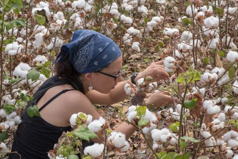
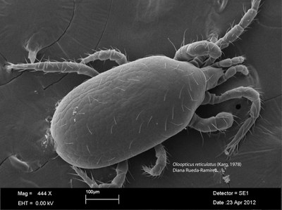

## Short CV

My main interest is the study of soil predatory mites, especially those belonging to the order Mesostigmata. I am interested in their taxonomy, morphology, diversity, ecology, and practical use for the biological control of agricultural pests. I am also studying nematodes in agricultural soils as important organisms in soil food webs. Currently, my research is focused on better understanding the interactions that Mesostigmata mites have in the soil with other organisms such as nematodes and trying to restore some trophic relationships in agroecosystems. My current research seeks to have a conservation biological control approach. 

*Oloopticus reticulatus* Karg
